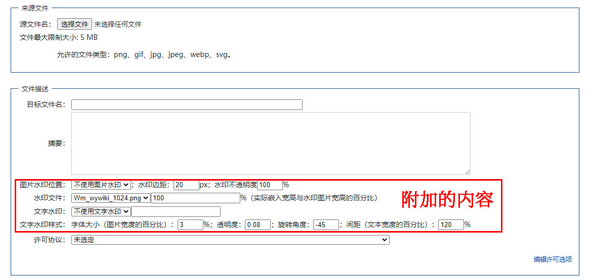

# mediawiki-Wywatermark
mediawiki-Wywatermark是为Mediawiki开发的一个插件。此插件在上传文件页面添加水印配置表单，并在上传完成对原图添加水印。

由于作者对代码只懂皮毛，代码并不科学，它只是实现功能，慎重用于正式环境，欢迎帮忙修正、优化。

## 插件使用的Hook及功能
* 使用[UploadForm:initial](https://www.mediawiki.org/wiki/Manual:Hooks/UploadForm:initial)在上传文件表单添加水印配置选项；
* 使用[UploadComplete](https://www.mediawiki.org/wiki/Manual:Hooks/UploadComplete)在上传文件完成时对文件使用php的imagick对图片添加水印。

## 环境要求
* 系统需要安装imagemagick；
* php需要安装imagick、mbstring。

## 使用方法
* 下载插件放在`extensions`文件夹内，重命名此插件文件夹名为`Wywatermark`；
* 在`LocalSettings.php`加入`wfLoadExtension( 'Wywatermark' );`；
* 【重要】设置参数`$wgWywatermarkCat='水印图片所在分类名';`（文本），默认为“水印”。会获取该分类中的页面标题到“水印文件”下拉选择框选项中（此分类中应只包含水印图片文件，否则当选择的不是文件时，程序获取不到图片文件而出错）。使用前，先将水印图片上传到网站并归类到设定分类中，才有水印图片文件选择。
* 【可选】设置参数`$wgWywatermarkText=["水印文本1","水印文本2"];`（数组）。不设置则“文字水印”下拉选择框只有`不使用文字水印，上传者用户名，右侧输入文本`；设置此参数则可添加预设文本到下拉选择框选项中；
* 完成。

## 更新日志
* 20220716：（小）调整文字水印不透明度为0-100，调整后全部数字参数均为整数方便输入。调整嵌入水印百分比为相对被嵌入图片的宽度的百分比，更直观。
* 20220521：改用内置函数`getLocalRefPath()`获取本地文件路径，解决了本地目录不是默认目录或图片设置另外的链接时路径错误问题。（暂不考虑图片与网站不是同一服务器的情况）
* 20220520：调整水印图片为获取网站中指定分类的已上传文件；合并部分参数到上传表单第二列（有点难看，但是减少占用行数）；可设置水印文件实际使用宽度。
* 20220519：初步实现功能。

## 存在的问题
* 尚不明确有无插件冲突或其他问题。

## 相关链接
* 因需要使用中文字体，现使用的是思源黑体。字体来源：[思源黑体](https://github.com/adobe-fonts/source-han-sans)
* 若使用其他字体文件：字体文件存放在`resources/font`目录中，修改`includes/WywatermarkHooks.php`文件中这一行的文件名：`$draw->setFont(dirname(dirname(__FILE__)).'/resources/font/YourFont.ttf');`。

## 上传文件页面截图

